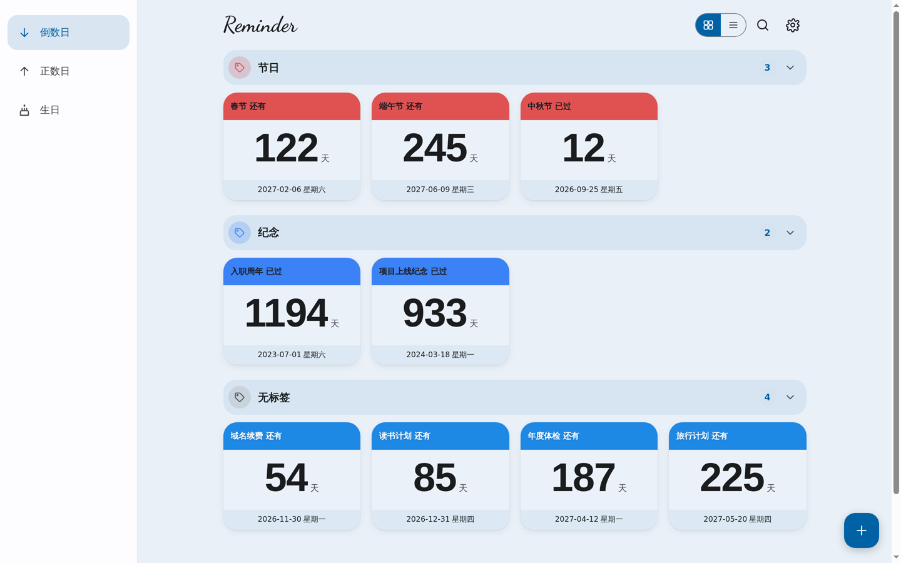
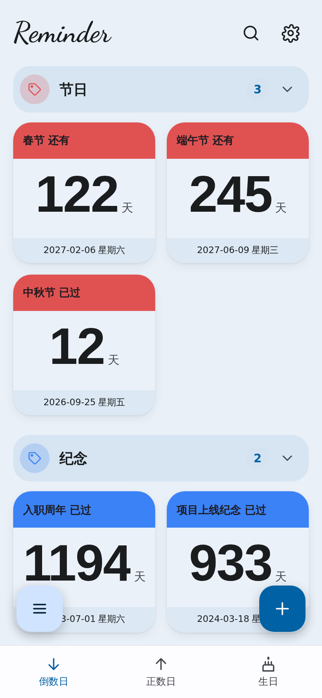
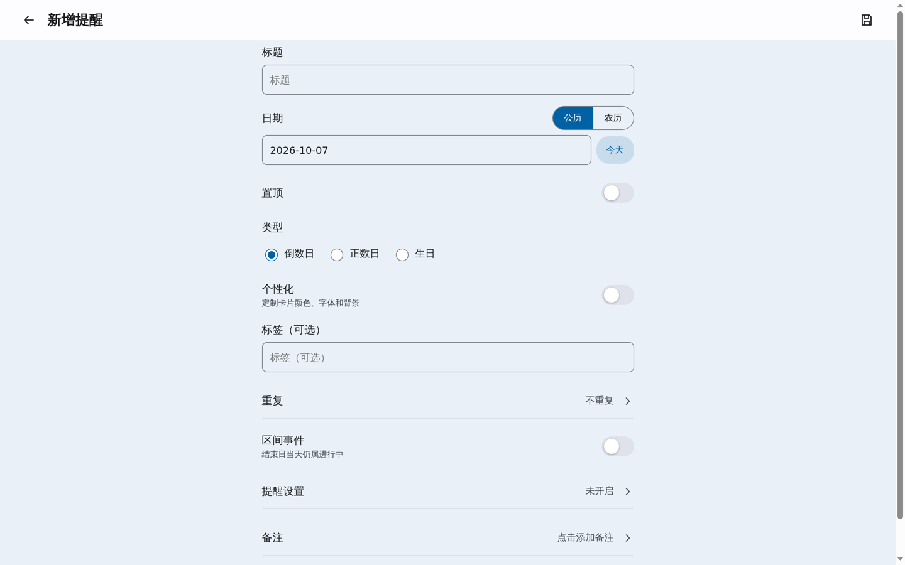
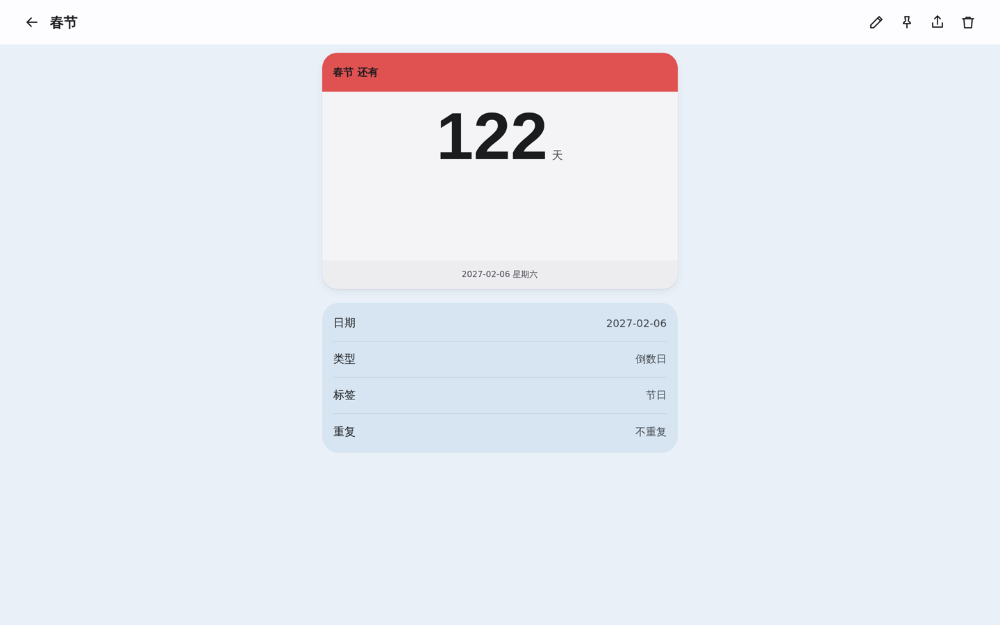
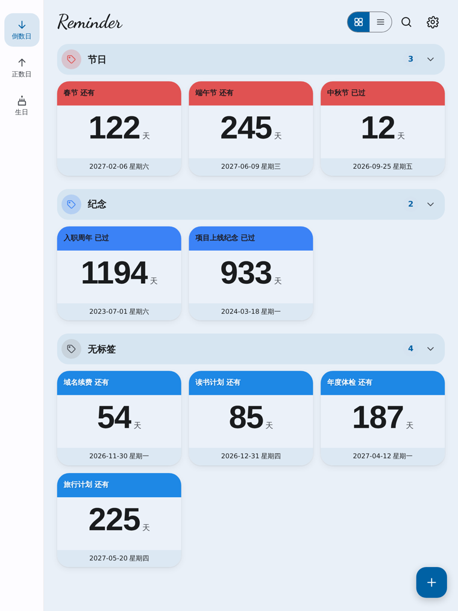
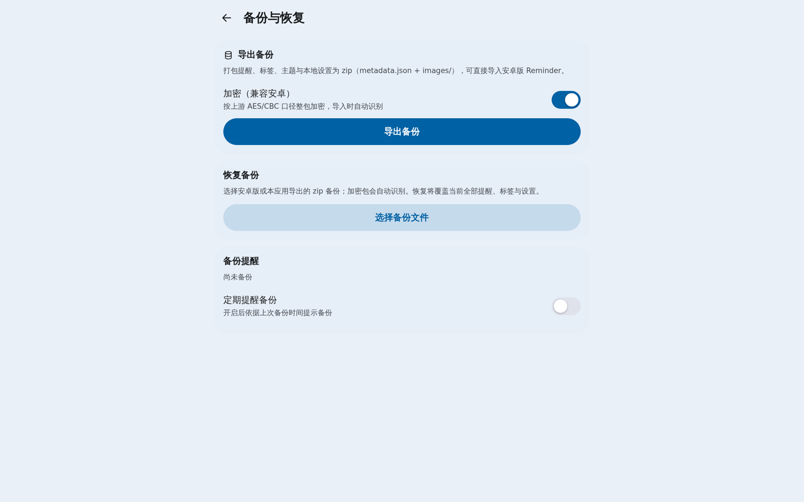
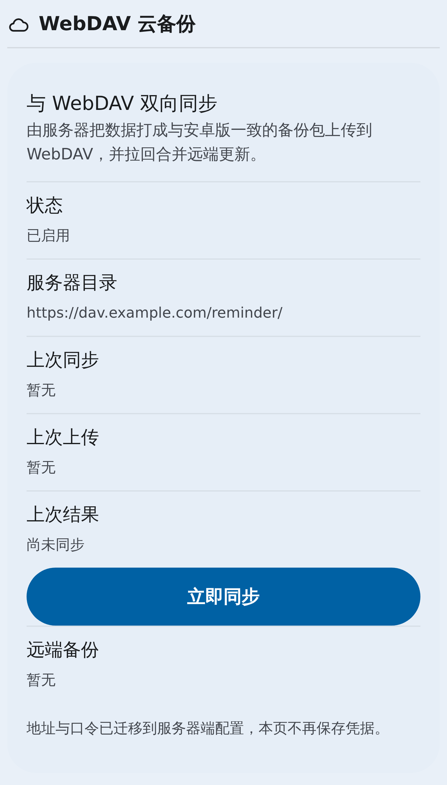
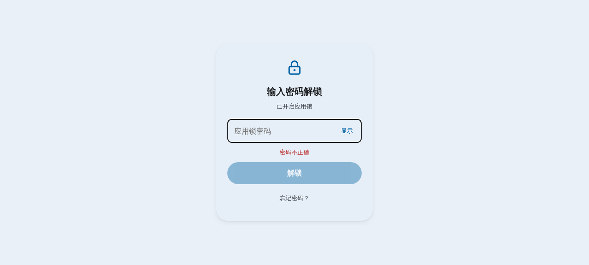

# ReminderWeb

把安卓应用 **Reminder**（纪念日 / 倒数日管理）做成响应式 Web 应用：视觉风格一致、行为语义一致、**数据与安卓版双向互通**。

- 三种部署形态：**纯客户端**（纯静态，数据存浏览器 IndexedDB，无后端）、**后端自带前端**（推荐，一条命令起服务）、**前后端分离**（后端只做 API + CORS，前端独立托管）。
- 运行模式可显式配置：设置页本机选择（`localStorage`）> 静态根 `config.json` > 构建期 `VITE_APP_MODE`（`server`/`client`/`auto`，默认 `auto`）> 探测 `/api/health`；设置页可在两种模式间切换并做整体数据迁移（覆盖式，迁移前自动导出备份）。
- 与安卓版共用备份格式（zip + AES/CBC 加密），可互相导入导出。
- 许可：**GPL-3.0**。

## 功能

- 首页：置顶 / 标签分组、卡片与列表两种布局、超大天数、区间事件阶段标签、三档响应式布局。
- 新增 / 编辑：公历 / 农历日期、倒数日 / 正数日 / 生日、重复、区间事件、提醒设置、备注。
- 详情：卡片翻面看备注、生日年龄 / 生肖 / 星座、分享成图片。
- 搜索、标签管理、日期计算器、设置（主题 / 纯黑 / 种子色 / 视图 / 滚动收起 / 提醒 / 数据 / 安全 / 关于）。
- 备份与恢复：导出 / 导入安卓互通 zip，可选「加密（兼容安卓）」。
- WebDAV 云备份：**服务器模式**由后端与 WebDAV 双向同步（凭据只存服务端环境变量）；**客户端模式**浏览器直连 WebDAV（地址/用户名/口令/自动备份/保留份数/测试连接/立即备份/从云端恢复/云端备份列表，凭据只存本机）。
- 分享成图片：Canvas 绘制同款卡片，导出 PNG / 复制到剪贴板。
- PWA：离线可用、可安装；页面打开时到点提醒，Service Worker 兜底。
- 提醒方式支持导出 `.ics`；应用锁密码（任意字符，本地 PBKDF2 加盐存储，可显示/隐藏，支持旧 PIN 自动升级）。
- 计算语义与安卓端一致，并有单元测试覆盖。

## 与安卓版的差异

| 安卓能力 | Web 版处理 |
| --- | --- |
| 桌面小组件（3 种尺寸） | 不做（浏览器无此能力） |
| 小米超级岛 / 实时提醒通知样式 | 不做 |
| 写入系统日历 | 改为**导出 .ics** 文件 |
| 指纹 / 人脸解锁 | 改为**应用锁密码**（任意字符，本地 PBKDF2 加盐存储） |
| 禁止截屏录屏 | 不做 |
| 系统壁纸动态取色 | 改为「跟随种子色」 |
| 应用内检查更新 | 改为「关于页显示版本 + 仓库链接」 |
| 液态玻璃 / 光栅玻璃 / 折射参数 | 不实现视觉效果，但**备份字段原样保留** |
| 后台精确唤醒提醒 | 页面打开时用 Notification API；另提供 Service Worker 周期检查（能力受限时明确提示） |
| 本地数据库 | 服务器模式：可选后端（Node.js + SQLite）为**唯一真数据源**，前端 IndexedDB 降级为只读离线缓存；客户端模式：纯 IndexedDB。设置页显示当前模式 |
| WebDAV 云备份 | 服务器模式：**服务端与 WebDAV 双向同步**，凭据只存服务端环境变量；客户端模式：浏览器直连 WebDAV，凭据只存本机。两种模式都可查看/恢复/删除云端任意本应用备份 |

## 技术栈

Vite + React 19 + TypeScript（strict）、react-router-dom、zustand、idb-keyval（IndexedDB）、
lunar-javascript（农历，按需加载）、@material/material-color-utilities（M3 动态取色）、
fflate（备份 zip）、vite-plugin-pwa（离线 / 可安装）、vitest（测试）、CSS 变量 + CSS Modules。

## 开发 / 构建 / 部署

```bash
# 安装依赖
npm install

# 本地开发（默认 127.0.0.1:5173）
npm run dev

# 类型检查 + 生产构建，产物在 dist/
npm run build

# 本地预览构建产物
npm run preview

# 代码检查 / 单元测试
npm run lint
npm test

# 后端（可选）：直接运行 TypeScript（Node ≥ 24），无需编译
npm run dev:server      # 开发：node --watch server/src/index.ts
npm start               # 生产：node server/src/index.ts

# 后端类型检查 / node:test 测试
npm run typecheck:server
npm run test:server
```

部署：`npm run build` 后把 `dist/` 作为静态站点托管即可。应用使用 `BrowserRouter`，
需将未知路径回退到 `index.html`。

## 运行模式（服务器 / 客户端）

前端启动时按以下优先级决定运行模式：

1. **本机选择**：设置页「运行模式」切换写入的 `localStorage['reminderweb:app-mode']`（`server` / `client`），优先级最高。
2. 运行期配置：静态根下的 `config.json`，形如 `{ "mode": "server" }` 或 `{ "mode": "client" }`（可选，取不到就跳过）。适合一份构建产物在部署时切换模式。
3. 构建期环境变量 `VITE_APP_MODE`：`server` / `client` / `auto`，默认 `auto`。
4. `auto`：探测 `GET /api/health`，通则服务器模式，不通则客户端模式。

在设置页切换模式会走**整体数据迁移**（覆盖式）：服务器 → 客户端把后端全量（提醒 / 标签 / 设置 / 卡片背景图字节）覆盖到本机 IndexedDB；客户端 → 服务器把本机全量覆盖写入后端 `PUT /api/data/replace`。迁移前会自动导出一份 `reminder-backup-<时间>.zip`（含 `images/`）并下载；确认框写清方向、后果与条数，取消则不迁移；迁移成功才真正切模式，失败保持原模式。纯静态部署（未检测到后端）时服务器模式入口置灰。

**客户端模式（纯前端）**：数据存 IndexedDB，**完全不发任何 `/api` 请求**（本机显式选择模式时仅探测一次后端可达性用于置灰与自动选路）。「WebDAV 云备份」分组为浏览器直连形态（地址 / 用户名 / 口令 / 自动备份 / 保留份数 / 测试连接 / 立即备份 / 从云端恢复 / 云端备份列表，凭据只存本机）。「WebDAV 连接方式」可选 **自动（推荐）** / 同源代理 / 直连：自动在后端可达时经 `/api/webdav` 转发、不可达时直连。

**服务器模式**：以服务器 SQLite 为唯一真数据源；「WebDAV 云备份」为服务端策略面板（自动同步 / 间隔 / 保留份数 / 状态 / 立即同步 / 立即备份 / 云端备份列表），凭据由服务器环境变量持有，界面不出现地址与口令输入框，也不显示「WebDAV 连接方式」。

设置页「服务器」分组顶部显示当前模式（服务器模式 / 客户端模式（纯前端）/ 未连接后端）。

## 三种部署形态

### 1. 纯客户端（纯静态）

```bash
VITE_APP_MODE=client npm run build     # 产物 dist/ 不含任何后端依赖
```

把 `dist/` 丢到任意静态托管。nginx 片段（SPA 回退 + `sw.js` 不缓存）：

```nginx
server {
    listen 443 ssl;
    server_name reminder.example.com;
    root /var/www/reminderweb;
    index index.html;

    location = /sw.js {
        add_header Cache-Control "no-cache";
    }
    location / {
        try_files $uri /index.html;
    }
}
```

### 2. 后端自带前端（默认）

```bash
npm install && npm run build
SERVE_STATIC=1 AUTH_MODE=builtin AUTH_PASSWORD=changeme npm start
```

后端在 `dist/` 存在时直接服务前端，一条命令搞定。

### 3. 前后端分离（跨域）

后端只做 API 并允许前端来源跨域；前端构建时指向后端地址、跨域携带 Cookie：

```bash
# 后端
SERVE_STATIC=0 ALLOWED_ORIGINS=https://app.example.com COOKIE_SAMESITE=none npm start
# 前端
VITE_API_BASE=https://api.example.com npm run build
```

- `ALLOWED_ORIGINS`：逗号分隔的精确来源（含 scheme 与端口）。命中才回 `Access-Control-Allow-Origin` + `Access-Control-Allow-Credentials: true` + `Vary: Origin`，并处理 `OPTIONS` 预检；未命中不回任何 CORS 头（不使用 `*`）。
- `COOKIE_SAMESITE=none`：跨站前后端分离时使用，Cookie 仍固定 `Secure`（必须经 HTTPS）；同站默认 `lax`。
- 前端配置了 `VITE_API_BASE` 时请求用 `credentials: 'include'`，同源仍用 `same-origin`。

nginx 片段（前端静态站，后端另址）：

```nginx
server {
    listen 443 ssl;
    server_name app.example.com;
    root /var/www/reminderweb;
    index index.html;

    location = /sw.js {
        add_header Cache-Control "no-cache";
    }
    location / {
        try_files $uri /index.html;
    }
    # 后端在 api.example.com；若同域反代到 /api 则无需 CORS，可省略
    location /api/ {
        proxy_pass https://api.example.com;
        proxy_set_header Host $host;
        proxy_set_header X-Forwarded-For $proxy_add_x_forwarded_for;
        proxy_set_header X-Forwarded-Proto $scheme;
    }
}
```

Service Worker 与 manifest 在构建时自动生成。若启用内置后端，后端会在构建产物存在时
直接服务 `dist/`，无需额外静态托管（见下一节）。

## 部署（后端模式）

后端零运行时依赖：只用 Node 内置模块（`node:sqlite` / `node:crypto` / `node:zlib` / `node:http`），
源码即 TypeScript，由 Node ≥ 24 直接运行（`node server/src/index.ts`），无需构建。
前端构建期可用 `VITE_API_BASE` 指定后端地址（留空 = 与页面同源 `/api`）。

### 环境变量

复制 `.env.example` 为 `.env` 并按需修改（示例值均为占位符，切勿使用真实凭据）：

| 变量 | 默认 | 说明 |
| --- | --- | --- |
| `HOST` | `127.0.0.1` | 监听地址。`AUTH_MODE=sso` 时必须保持回环，否则拒绝启动 |
| `PORT` | `18940` | 监听端口 |
| `DATA_DIR` | `./server/data` | 数据目录（SQLite 数据库 `reminder.db`） |
| `AUTH_MODE` | `builtin` | `builtin` / `sso` / `none` |
| `AUTH_USER` | `admin` | builtin 用户名 |
| `AUTH_PASSWORD` | 空 | builtin 初始口令；首次启动时建立，明文不入库、不落日志。留空且库中无口令时生成一次性随机口令并只打印一次 |
| `SESSION_TTL_DAYS` | `30` | 会话有效期（天） |
| `LOGIN_RATE_LIMIT` | `5` | 每 IP 每 10 分钟允许的登录失败次数 |
| `TRUST_PROXY` | `1` | 是否信任 `X-Forwarded-For`（取真实 IP 做限流） |
| `SERVE_STATIC` | `1` | 是否由后端服务 `dist/`（纯 API 部署可关） |
| `ALLOWED_ORIGINS` | 空 | 跨域白名单（逗号分隔精确来源）；留空不启用 CORS，拒绝 `*` |
| `COOKIE_SAMESITE` | `lax` | `lax` / `none`；`none` 用于跨站前后端分离，仍固定 `Secure` |
| `LOG_LEVEL` | `info` | `debug` / `info` / `warn` / `error` |
| `VITE_APP_MODE` | `auto` | 前端构建期运行模式：`server` / `client` / `auto` |
| `VITE_API_BASE` | 空 | 前端构建期的后端地址前缀；空 = 同源 `/api`；非空时跨域带 Cookie |
| `WEBDAV_ENABLED` | `0` | 自动同步开关的**初始默认值**（首次读取时落库，之后在设置页调整，所有设备一致） |
| `WEBDAV_URL` | 空 | WebDAV 目录地址（结尾斜杠自动补齐）。启用但留空会拒绝启动 |
| `WEBDAV_USERNAME` / `WEBDAV_PASSWORD` | 空 | Basic 凭据；只从环境变量读取，绝不返回前端、绝不写日志 |
| `WEBDAV_INTERVAL_MINUTES` | `10` | 同步间隔的**初始默认值**（分钟）；设置页只允许 `5 / 10 / 30 / 60` |
| `WEBDAV_DEBOUNCE_SECONDS` | `60` | 本机数据变动后的延迟上传（合并节流） |
| `WEBDAV_ENCRYPT` | `1` | 上传的包是否加密（与安卓端「备份数据加密」一致） |
| `WEBDAV_KEEP` | `10` | 保留份数的**初始默认值**（设置页范围 `1..50`），只清理本服务上传的备份 |
| `WEBDAV_TIMEOUT_SECONDS` | `20` | 单次 HTTP 请求超时（秒） |
| `WEBDAV_RELAY_ALLOW_PRIVATE` | `0` | 客户端模式同源代理是否放行指向回环 / 内网 / 链路本地 / 云元数据的目标；`1` 显式放开（默认拒绝，SSRF 防护） |

`WEBDAV_*` 详见下文「WebDAV 双向同步（与安卓版共用同一目录）」。

### 同源代理（客户端模式经后端转发 WebDAV）

- 路由 `* /api/webdav/*`，需登录（沿用现有认证）。目标地址与凭据由前端随请求头 `X-Dav-Url` / `X-Dav-User` / `X-Dav-Password` 提供，**仅本次请求使用，不落库、不写日志、不出现在响应里**。
- 支持 `PROPFIND / PUT / GET / HEAD / DELETE / MKCOL`，透传 `Depth` / `Content-Type` / `If-Match` / 请求体，原样返回状态码与 `DAV` / `ETag` / `Content-Length` / `Content-Type`。
- 只允许 `http` / `https`，默认拒绝回环 / 内网 / 链路本地 / 云元数据地址；内网自建 WebDAV 可显式 `WEBDAV_RELAY_ALLOW_PRIVATE=1`。

### 启动

```bash
npm install
npm run build            # 生成 dist/
AUTH_MODE=builtin AUTH_PASSWORD=changeme npm start
# 启动日志会打印监听地址、认证模式、数据目录与静态目录（绝不打印口令/令牌）
```

### systemd（示例）

```ini
[Unit]
Description=ReminderWeb backend
After=network.target

[Service]
WorkingDirectory=/opt/reminderweb
EnvironmentFile=/opt/reminderweb/.env
ExecStart=/usr/bin/node server/src/index.ts
Restart=on-failure
User=reminderweb

[Install]
WantedBy=multi-user.target
```

### nginx 反向代理（示例）

后端只监听 `127.0.0.1:18940`，由 nginx 终止 TLS 并转发。
`__Host-rw_session` Cookie 要求 HTTPS，请务必通过 nginx 提供 HTTPS。

```nginx
server {
    listen 443 ssl;
    server_name reminder.example.com;

    location / {
        proxy_pass http://127.0.0.1:18940;
        proxy_set_header Host $host;
        proxy_set_header X-Forwarded-For $proxy_add_x_forwarded_for;
        proxy_set_header X-Forwarded-Proto $scheme;
    }
}
```

### builtin 与 sso 如何选

- **builtin（默认，开源用户）**：后端自带账号密码。首次启动用 `AUTH_PASSWORD` 建立，
  或留空让后端生成一次性随机口令（登录后在数据设置里改）。前端 401 时会弹出内置登录界面。
- **sso（本人部署）**：由前置网关完成登录并注入 `X-Auth-User` 头，后端只读该头，不使用 Cookie。
  此时 `HOST` 必须保持回环（`127.0.0.1` / `::1` / `localhost`），否则拒绝启动，防止伪造头绕过网关。
  前端 401 时跳转 `/_auth/login?next=<当前路径>`。
- **none**：仅本机开发，所有请求视为用户 `dev`；非回环 + `NODE_ENV=production` 时拒绝启动。

### 数据目录与备份

- SQLite 数据库与 WAL 文件位于 `DATA_DIR`（默认 `server/data/`，已在 `.gitignore` 中忽略）。
- 备份：停止服务后直接复制整个 `DATA_DIR` 即可；也可用 SQLite 的 `.backup` 命令做在线备份。
- 数据模型：`reminders` / `tags` 用条目级 `updatedAt` + 墓碑合并，`settings` 整体同步；
  应用锁、WebDAV 凭据、通知权限等**仅本机**设置不会上传服务器。

### WebDAV 双向同步（与安卓版共用同一目录）

后端可直接与 WebDAV 服务器双向同步，备份包格式与安卓版完全一致，**同一个目录可同时被安卓版与本服务使用**：

- 开启：`.env` 设置 `WEBDAV_URL`（如 `https://dav.example.com/reminder/`）与
  `WEBDAV_USERNAME` / `WEBDAV_PASSWORD`。凭据只存在于服务端环境变量，不返回前端、不写日志。
  `WEBDAV_ENABLED` / `WEBDAV_INTERVAL_MINUTES` / `WEBDAV_KEEP` 只是**初始默认值**，
  首次读取时落库，之后在设置页「WebDAV 云备份」里改，改动立即生效、重启保持、所有设备一致。
- 每个周期：`PROPFIND` 取最新备份（与上次已处理的比对 etag / 修改时间，
  未变则跳过下载）→ 下载 → 解密解包 → 与库内数据逐条合并（`updatedAt` + 墓碑）→ 有变化才落库并 revision++ → 上传一份新包。
- 本机数据变更后按 `WEBDAV_DEBOUNCE_SECONDS` 合并节流上传，避免每次变动都写远端；同步任务在进程内串行。
- 加密开关 `WEBDAV_ENCRYPT`：`1` 时用上游 AES-256-CBC 口径加密（与安卓端「备份数据加密」互通，两种都能读）。
- 保留与清理（设置页可改）：只清理**由本服务上传**的旧包，绝不删除安卓端写入的历史备份。
- 云端备份管理：设置页可查看、恢复、删除**任意**本应用备份（`reminder-backup-*.zip`，不再区分来源）。
  恢复复用与自动同步完全相同的合并纯函数，**只读不删远端**、重复恢复幂等；删除前二次确认并点明会从 WebDAV 目录删除该文件，
  绝不操作同目录其它文件。手动「立即同步 / 立即备份 / 恢复 / 删除」不受自动同步开关限制。
- 接口：`GET/PUT /api/sync/config`、`GET /api/sync/status`、`POST /api/sync/now`、`POST /api/sync/upload`、
  `GET /api/sync/files`、`POST /api/sync/restore`、`DELETE /api/sync/files/:name`。
  状态响应含 `nextSyncAt` / `lastMerged` / `lastAction`，**不含凭据**。
- 失败不致命：任何异常都只记录脱敏日志与状态、下个周期继续；连续失败按指数退避（上限 4× 轮询间隔）。

## 备份格式（与安卓互通）

- `.zip`，内含 `metadata.json`（字段名与安卓 `BackupData` 逐字对齐）与 `images/<文件名>`
  （文件名与 `cardBackgroundImagePath` 一致），可选 `fonts/`。
- 加密包：整包 `AES/CBC/PKCS5Padding`，密钥 = `SHA-256(seed)`、`seed[i] = obfuscated[i] XOR 90`；
  密文布局 `[16 字节 IV][密文]`。Web 端用 `crypto.subtle`（`AES-CBC`）实现同口径加解密。
- 备份文件名：`reminder-backup-YYYYMMDD-HHmmss.zip`。
- 未知字段（如液态玻璃参数）导入导出原样保留，不丢数据。
- 同一目录可同时被**安卓版**与**本服务**使用：安卓端写入的备份包会被拉回逐条合并，本服务上传的包安卓端也能直接恢复。

### WebDAV 云备份

云备份有两种形态，取决于运行模式：

- **服务器模式**：由服务端接管。在 `.env` 配置 `WEBDAV_URL` 与凭据（见上文「WebDAV 双向同步」），
  自动同步开关 / 间隔 / 保留份数存在服务器上，设置页「WebDAV 云备份」可直接调整，所有设备一致；
  界面不出现地址与口令输入框，凭据只由服务器持有。
- **客户端模式（纯前端）**：浏览器直连 WebDAV。设置页「WebDAV 云备份」填写服务器地址 / 用户名 / 口令，
  可测试连接、立即备份、从云端恢复、查看与删除云端备份，并支持自动备份与保留份数；凭据只存本机、
  不上传服务器、不进导出备份。
- 两种模式都可查看、恢复、删除云端任意 `reminder-backup-*.zip` 备份（删除前二次确认，会从 WebDAV 目录删除该文件；恢复绝不写远端）。
- 「导出为文件 / 从文件恢复」为本地手动路径，与云端互不影响；卡片背景图会随导出包带在 `images/` 内。

## 截图

| 首页（桌面） | 首页（手机） |
| --- | --- |
|  |  |

| 新增 / 编辑 | 详情 |
| --- | --- |
|  |  |

| 平板 |
| --- |
|  |

| 备份与恢复 | WebDAV 云备份 | 应用锁 |
| --- | --- | --- |
|  |  |  |

> 同一套界面在三种宽度下自适应：手机（底部导航 + 右侧抽屉「目录」，窄屏同样保留导航）、
> 平板与桌面（左侧导航，卡片网格 2 / 3 列）。截图为构建产物实机截图，
> 其中示例数据、`https://dav.example.com/dav/`、`davuser` 等均为占位内容。

## 许可

本项目以 **GPL-3.0** 发布，见 [LICENSE](LICENSE)。上游 Reminder 亦为 GPL-3.0，
因此本衍生作品沿用同一许可。

## 致谢

- [ybhgl/Reminder](https://github.com/ybhgl/Reminder)：本项目的直接上游（Kotlin + Jetpack Compose），
  数据模型、计算语义、备份格式与视觉均以其为参照。
- [lentikr/Reminder](https://github.com/lentikr/Reminder)：上游思路的另一实现，一并致谢。
- 运行依赖：React / React Router / Zustand（MIT）、lunar-javascript（MIT）、
  @material/material-color-utilities（Apache-2.0）、fflate（MIT）、idb-keyval（MIT）。
- 字体：Dancing Script（SIL OFL 1.1，自托管子集）。

## 仓库

- 源码：<https://github.com/YLing2024/ReminderWeb>

> 示例中的域名（如 `reminder.example.com`）均为占位符，不代表真实服务。
